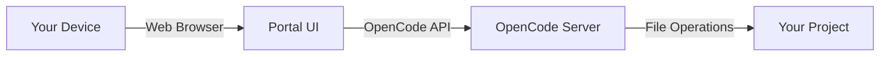

<Note>
  **Disclaimer**: This is a personal project and is not related to the official OpenCode team. OpenCode Portal is a community-built interface for interacting with OpenCode instances.
</Note>

## What is OpenCode Portal?

OpenCode Portal is a mobile-first web UI for [OpenCode](https://opencode.ai), the AI coding agent. While OpenCode comes with an official web interface, it's currently under development and has limited mobile support. Portal bridges this gap by providing a responsive, touch-optimized interface you can access from any device.

Whether you're on your phone, tablet, or desktop, Portal gives you full control over your OpenCode sessions with an interface designed for the modern web.

## Key features

<CardGroup cols={2}>
  <Card title="Mobile-first design" icon="mobile">
    Fully responsive interface optimized for touch interactions and small screens
  </Card>
  
  <Card title="Session management" icon="messages">
    Create, view, and manage multiple OpenCode sessions with real-time chat
  </Card>
  
  <Card title="File mentions" icon="at">
    Reference files using `@filename` syntax with autocomplete powered by fuzzy search
  </Card>
  
  <Card title="Git integration" icon="git-branch">
    View unified diffs with syntax highlighting and file-by-file changes
  </Card>
  
  <Card title="Multi-instance support" icon="server">
    Connect to multiple OpenCode instances across different projects
  </Card>
  
  <Card title="Model selection" icon="sparkles">
    Switch between AI models and providers on the fly
  </Card>
</CardGroup>

## How it works

OpenCode Portal connects to a running OpenCode server via the [OpenCode SDK](https://www.npmjs.com/package/@opencode-ai/sdk). The portal provides a web interface that communicates with your local or remote OpenCode instance.



You can run Portal locally alongside OpenCode, or deploy it to a server and access it remotely via VPN (like Tailscale) for secure mobile access.

## Use cases

### Remote coding from mobile

Deploy Portal and OpenCode on a VPS, then connect securely via Tailscale or another VPN. Now you can review changes, chat with your AI assistant, and manage sessions from your phone or tablet.

```bash
[Your Phone] ---(Tailscale)---> [VPS running Portal + OpenCode]
```

### Multi-project workflows

Run OpenCode instances across multiple projects and switch between them seamlessly. Portal's instance manager shows all running instances with their ports and directories.

### Collaborative sessions

Share your Portal URL with team members (over a secure network) to let them view sessions, inspect diffs, and collaborate on AI-assisted development.

## Tech stack

Portal is built with modern web technologies:

- **[React Router](https://reactrouter.com)** - React framework
- **[IntentUI](https://intentui.com/)** - Component library
- **[Tailwind CSS](https://tailwindcss.com)** - Utility-first styling
- **[Nitro](https://nitro.build)** - Server framework
- **[OpenCode SDK](https://www.npmjs.com/package/@opencode-ai/sdk)** - API client
- **[Bun](https://bun.sh)** - JavaScript runtime and package manager

## Next steps

<CardGroup cols={2}>
  <Card title="Quickstart" icon="rocket" href="/quickstart">
    Get started in under 5 minutes
  </Card>
  
  <Card title="GitHub Repository" icon="github" href="https://github.com/hosenur/portal">
    View source code and contribute
  </Card>
  
  <Card title="OpenCode Docs" icon="book" href="https://opencode.ai/docs">
    Learn more about OpenCode
  </Card>
  
  <Card title="Discord Community" icon="discord" href="https://discord.gg/7UJ5KYfhNE">
    Join the community
  </Card>
</CardGroup>